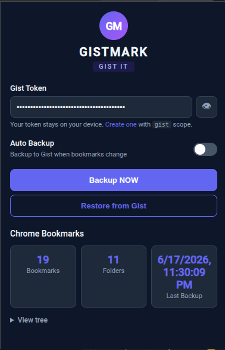

# GistMark

**Backup and restore your Browser bookmarks to a private GitHub Gist.**



## Features

- **Backup** — one-click upload of your entire bookmark tree (folders, sub-folders, all bookmarks) to a private GitHub Gist
- **Auto-backup** — automatically syncs to Gist 15 seconds after any bookmark change
- **Restore** — import bookmarks from your Gist into a dated folder under "Other Bookmarks" on a new browser
- **Compact JSON** — stores bookmarks in a minimal format (no Chrome internal IDs, just titles, URLs, and folder structure)
- **Dark theme** — easy-on-the-eyes popup UI
- **Cross-browser** — works on Chrome and Firefox 120+
- **No build tools** — pure vanilla JavaScript, HTML, and CSS

## How to use

1. Get a [GitHub personal access token](https://github.com/settings/tokens) with the `gist` scope
2. Load the extension:
   - **Chrome**: `chrome://extensions` → Developer mode → "Load unpacked" → select this folder
   - **Firefox**: `about:debugging#/runtime/this-firefox` → "Load Temporary Add-on" → select `manifest.json`
3. Paste your token in the popup
4. Click **Backup NOW** to upload your bookmarks

To restore on another device, install the extension, paste your token, and click **Restore from Gist**.

## File structure

```
GistMark/
├── manifest.json          # Extension manifest (MV3)
├── background.js          # Service worker — auto-backup timer + Gist API
├── popup/
│   ├── popup.html         # Popup UI
│   ├── popup.js           # Popup logic
│   └── popup.css          # Dark theme styles
├── screenshot/
│   └── GistMark.png       # Popup screenshot
└── icons/
    ├── icon16.png
    ├── icon48.png
    └── icon128.png
```

## Gist format

Your bookmarks are saved as a single `GistMark-bookmarks` file in a private Gist:

```json
{"browser":"Mozilla/5.0 ...","version":"1.0.0","createDate":...,"bookmarks":[{"title":"ToolbarFolder","children":[...]},{"title":"MenuFolder","children":[]},{"title":"MobileFolder","children":[]}]}
```

## Tech stack

- **Manifest V3** — latest extension API
- **Chrome Bookmarks API** — reads/writes the native bookmark tree
- **GitHub REST API** — creates and updates the Gist
- **Zero build** — no npm, no bundlers, straight JavaScript
